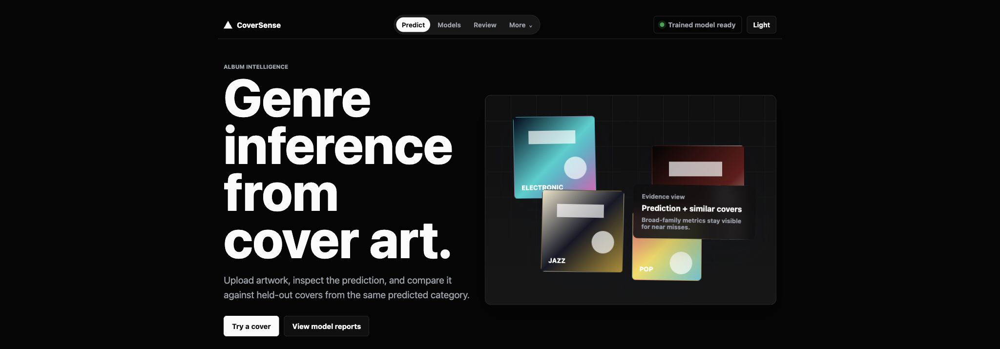
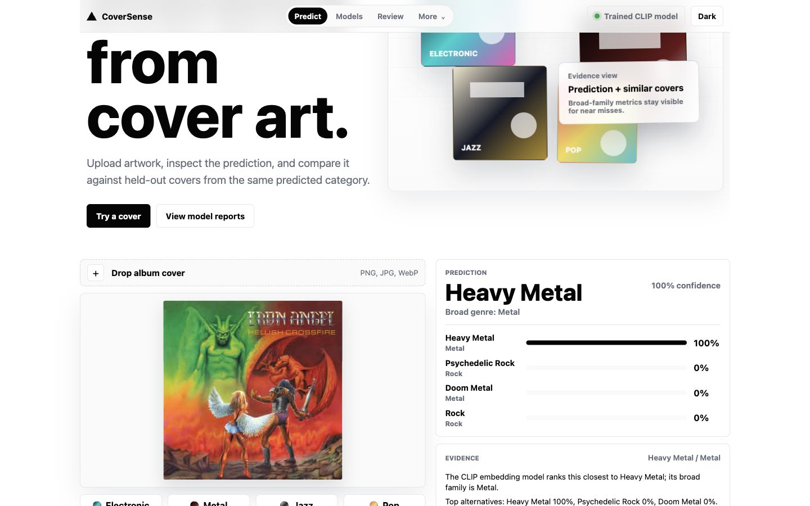
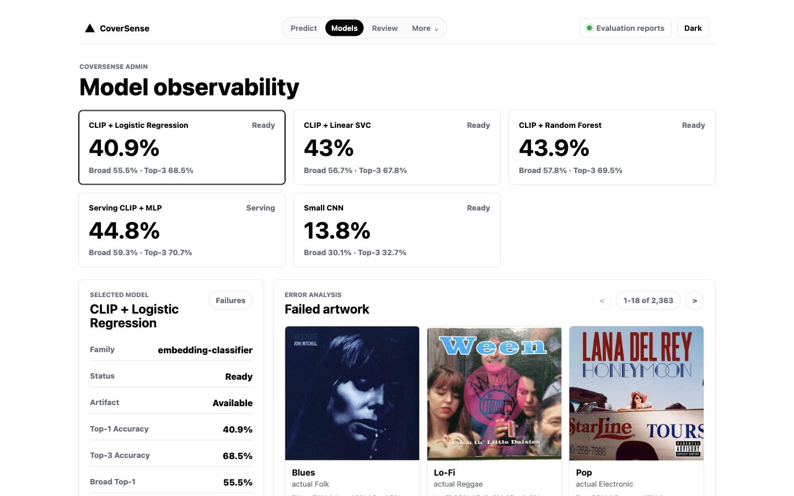

# CoverSense

CoverSense infers likely music genres from CD or album cover art. The app pairs a React frontend with a FastAPI backend that serves trained CLIP-based classifiers, similar-cover evidence, and model evaluation reports.

Upload artwork or choose one of the sample covers to inspect exact-genre and broad-genre predictions. The admin view compares model families, validation metrics, and failed artwork examples for error analysis.

## Screenshots

### Landing Page



### Genre Prediction



### Model Observability



## Run App With Backend

```bash
uv sync
uv run uvicorn backend.server:app --reload --host 127.0.0.1 --port 8000
```

Then open `http://127.0.0.1:8000`.

For the React frontend workspace:

```bash
cd frontend
npm install
npm run dev
```

Run the backend on `127.0.0.1:8001` while using the Vite dev server; API calls are proxied from the frontend.

Model observability is available at `http://127.0.0.1:8000/admin`. It lists model artifacts, evaluation metrics, tuning details, and failed artwork examples for error analysis.

If `models/coversense_clip_classifier.joblib` is missing, train first with:

```bash
uv run python ml/download_hf_album_covers.py
uv run python ml/train_clip_classifier.py
```

## Accuracy Roadmap

The `ml/` folder adds the first real-model path:

1. Download a labeled album-cover dataset from Hugging Face.
2. Encode each cover with CLIP image embeddings.
3. Cache embeddings as the reusable experiment artifact.
4. Train swappable classifier heads.
5. Report exact top-1/top-3 accuracy plus broad-genre near-miss metrics.

Start here:

```bash
uv sync
uv run python ml/download_hf_album_covers.py --max-per-label 50
uv run python ml/build_embeddings.py
uv run python ml/train_classifier.py --classifier logreg
uv run python ml/predict_cover.py path/to/cover.jpg
```

Remove `--max-per-label 50` when you are ready to train on the full dataset.

Build a second dataset source without mixing it into the Hugging Face baseline:

```bash
uv run python ml/download_musicbrainz_cover_art.py --max-per-label 100
uv run python ml/build_embeddings.py \
  --metadata data/musicbrainz_cover_art/metadata.csv \
  --output embeddings/musicbrainz-clip-vit-base-patch32.npz
uv run python ml/train_classifier.py \
  --embeddings embeddings/musicbrainz-clip-vit-base-patch32.npz \
  --classifier logreg \
  --model-dir models/datasets/musicbrainz/clip-logreg \
  --report-dir reports/datasets/musicbrainz/clip-logreg
uv run python ml/evaluate_classifier.py \
  --model models/coversense_clip_classifier.joblib \
  --embeddings embeddings/musicbrainz-clip-vit-base-patch32.npz \
  --report-dir reports/datasets/musicbrainz/hf-serving-model-eval
uv run python ml/compare_dataset_sources.py
```

The comparison report is written to `reports/dataset_source_comparison.md`.

Try other classifier heads without rebuilding embeddings:

```bash
uv run python ml/train_classifier.py --classifier linear-svc
uv run python ml/train_classifier.py --classifier random-forest
uv run python ml/train_classifier.py --classifier mlp
```

Try a raw-pixel CNN baseline:

```bash
uv run python ml/train_cnn.py --epochs 8
uv run python ml/predict_cnn.py path/to/cover.jpg
```

CNN training uses hierarchy-aware sibling smoothing by default, so mistakes inside the same broad family, such as Doom Metal vs Death Metal, are treated as closer than mistakes across unrelated families.

Run a fuller CNN comparison with lightweight random hyperparameter search:

```bash
uv run python ml/train_cnn.py --trials 2 --trial-epochs 1 --epochs 3 --device cpu
```

For a fast smoke test, train on a small balanced subset:

```bash
uv run python ml/train_cnn.py --max-samples-per-label 25 --epochs 1 --image-size 96
```
